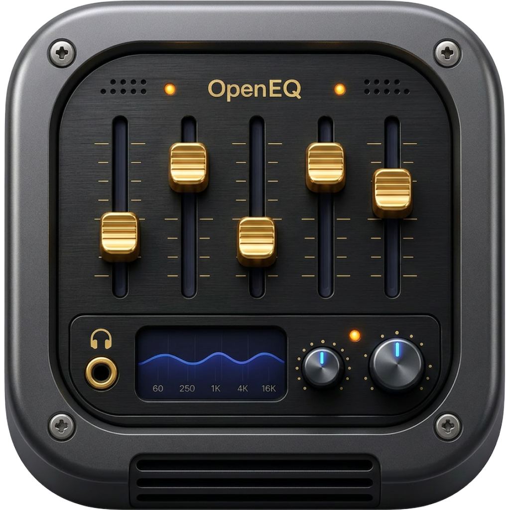
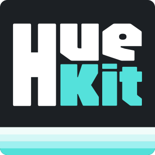
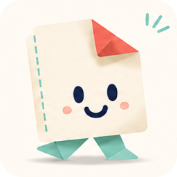

# Hello.

I'm **Ozan Kesici**.

Product Design • Design Systems • Frontend • AI

[My Studio](https://www.fionn.art) ·
[LinkedIn](https://www.linkedin.com/in/oznksc/) ·
[Behance](https://be.net/oznksc) ·
[Contra](https://contra.com/mrozankesici)

---

## About

I'm a Product Designer based in Türkiye. For the past 5+ years, I've been designing web and mobile experiences, building scalable design systems, and creating developer-ready interfaces for products used by thousands of people.

My work lives somewhere between product design and engineering. I enjoy building products where beautiful interfaces meet clean implementation.

Lately, I've been spending most of my time exploring Swift, AI-assisted workflows, design automation, and open-source software.

---

## Selected Work

###  OpenEQ

An open-source system-wide equalizer for macOS focused on performance, simplicity, and native user experience.

<small><kbd>Swift</kbd></small> <small><kbd>AppKit</kbd></small> <small><kbd>CoreAudio</kbd></small> <small><kbd>Open Source</kbd></small>

###  Huekit - Generate Design Systems & One Click Import

Generate complete design systems directly inside Figma. Design Tokens, Component Libraries, Variables, and documentation generated in seconds.

<small><kbd>Figma Plugin</kbd></small> <small><kbd>Automation</kbd></small> <small><kbd>Design Systems</kbd></small>

###  PinTraveler: Track Travel Map

A travel journal designed around memorable places rather than checklists. Apple-inspired interactions, editorial layouts, and thoughtful onboarding experiences.

<small><kbd>iOS</kbd></small> <small><kbd>Product Design</kbd></small> <small><kbd>Design System</kbd></small>

###  Pixie: Kids Games & Coloring

A playful learning experience for children combining coloring, creativity, and educational mini-games. Focused on accessibility, delightful interactions, and parent-friendly UX.

<small><kbd>Product Design</kbd></small> <small><kbd>Mobile</kbd></small> <small><kbd>Kids Experience</kbd></small>

###  Foldie

An AI-powered papercraft platform that transforms characters into printable modular paper toys. Designed for creativity, education, and hands-on play.

<small><kbd>AI</kbd></small> <small><kbd>Product Design</kbd></small> <small><kbd>Mobile</kbd></small>

---

## Toolbox

<table>
<tr>
<th width="33%">Design</th>
<th width="33%">Development</th>
<th width="33%">Backend</th>
</tr>
<tr>
<td>Figma</td><td>Swift</td><td>FastAPI</td>
</tr>
<tr>
<td>Design Systems</td><td>SwiftUI</td><td>Supabase</td>
</tr>
<tr>
<td>UI Kits</td><td>React Native</td><td>PostgreSQL</td>
</tr>
<tr>
<td>Prototyping</td><td>TypeScript</td><td>Docker</td>
</tr>
<tr>
<td>User Flows</td><td>Vue</td><td></td>
</tr>
<tr>
<td>Design Tokens</td><td>Angular</td><td></td>
</tr>
<tr>
<td>Interaction Design</td><td>HTML / CSS</td><td></td>
</tr>
<tr>
<td></td><td>Tailwind CSS</td><td></td>
</tr>
</table>

---

## Philosophy

> Great software isn't remembered because it has more features. It's remembered because it feels effortless.

I enjoy reducing complexity, creating consistent systems, and building products that people genuinely enjoy using.

---

## Current Focus

Building products where design and engineering work as one — exploring Apple-native interfaces, Swift & SwiftUI, AI-powered UX, Design Systems, Frontend Architecture, and Open Source.

---

## Open Source

I'm gradually open-sourcing the tools and systems I build — OpenEQ, Design Resources, and Figma Plugins.

---

## Beyond Work

Outside of design, you'll usually find me experimenting with indie products, exploring AI, refining interfaces pixel by pixel, or turning random ideas into working prototypes.

I believe curiosity compounds.

---

If you're building something meaningful, let's connect.

**Thanks for stopping by.**

